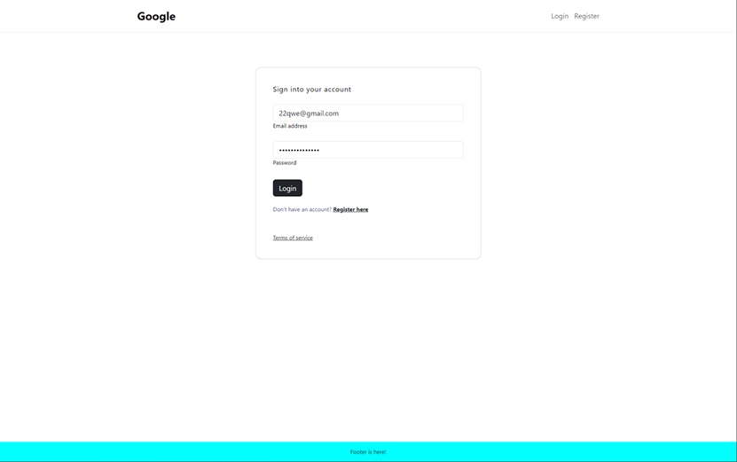
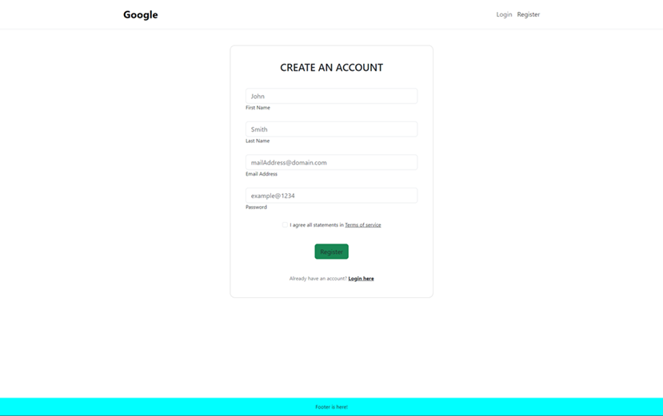
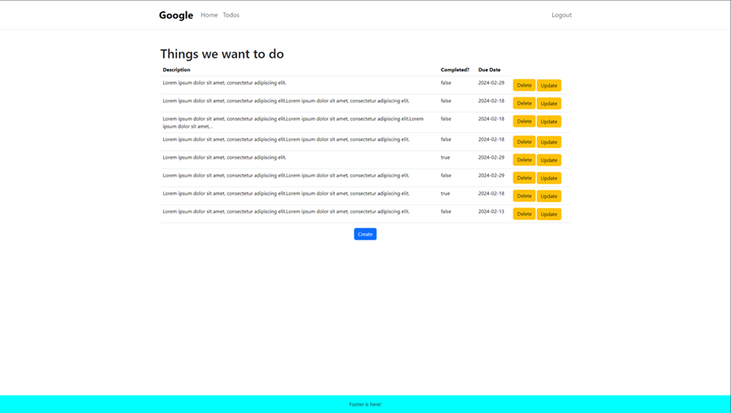

# Todo FrontEnd Project

I have created this project to understand how React.js, React components, and communication between a front-end and back-end application works. This project is not meant to represent a finished, production-ready project. I intentionally left some loose ends (which I will point out in Logic) because this project is meant for learning, not production. The project has a very simple structure:
- Login/Register Pages
- Todo Page
- Other small stuff like welcome page, page not found page.

# Login Page
When user tries to visit any page that exists, they are routed back to login page for authentication. 

All pages, including the login, have a header and footer. The footer is set to remain at the bottom of the page at all times, adjusting as needed if the page becomes scrollable. I use Bootstrap 5 for all pages and have employed basic templates for the login and register pages.  
The login page collects the user name and password, transmitting them to the Spring application (Todo Backend, also available on my GitHub). If the credentials are correct, the server responds with a status code 200 and a JWT token. This token is stored in the AuthContext.jsx page as context and is subsequently used in every request. In case of incorrect credentials, a warning appears below the 'Sign in with your account' header tag for the user.

# Register Page
If the user is not logged in, they can register on Register page.

Users can create their accounts on this page. The user's email address and password undergo validations. If the validations pass, the form is sent to the Spring application. The backend application also has the same validations, and if they are correct, a JWT token is returned. This token is saved in AuthContext, and the user is then routed to the welcome page.

# Todo Page

If the user is logged in, they can click on the 'Todo' link in the header, which is only available after logging in.

The user can check and update their todos or create new ones. The creation or update of a todo is performed using a modal.

# Logic

- The login, register, and logout logics are handled inside 'AuthContext.jsx.' The calls made to the server are stored in the 'api' folder and are executed using Axios. The token is stored when a user logs in or registers. While the server sends a token back with every call, the code is not currently arranged to update and store the new token.  
- The forms for creating or updating todos in the modals have validations. I employed a 'Formik'-type form in 'CreateTodo.jsx' and a regular form in 'UpdateTodo.jsx,' each with its own set of validations."  
- I didn't invest much effort in the design, as you can tell from its simplicity. I primarily used 'Bootstrap 5' for responsiveness and added some custom CSS to stylize elements where needed.
- The server side throws various exceptions, but I haven't included them in the response to inform the client side about these details. Most validations performed on the server side can also be done on the front end. While there might be issues on the server side that are not covered on the client side, I could explicitly handle such cases if needed, but for now, I will leave it as is.
